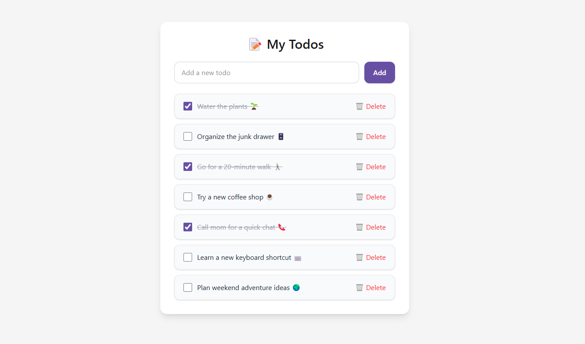

# ✅ Laravel Todo App (Material 3 Style)

A simple and elegant **Todo List** application built with **Laravel 11** and styled using **Tailwind CSS v4** to follow **Material Design 3** principles.

---

## ✨ Features

-   ✅ Add, update, and delete todos
-   🎨 Clean, responsive UI with Tailwind CSS and Material 3 styling
-   💾 Uses SQLite or MySQL database
-   🚀 Deployable on free platforms like Render

---

## 🧱 Tech Stack

-   **Backend:** PHP Laravel 11
-   **Frontend:** Blade + Tailwind CSS v4
-   **Database:** MySQL

---

## 📸 Screenshot



---

## 📦 Installation

### 1. Clone the Repo

```bash
git clone https://github.com/sheikhSulaiman/tgg-laravel-todo-app.git
cd tgg-laravel-todo-app
```

### 2. Install Dependencies

```bash
composer install
npm install
```

### 3. Environment Setup

```bash
cp .env.example .env
php artisan key:generate
```

> Optionally edit `.env` to use MySQL or SQLite

### 4. Run Migrations

```bash
php artisan migrate
```

### 5. Build Assets

```bash
npm run build
```

### 6. Start Development Server

```bash
php artisan serve
```

Visit `http://localhost:8000`

---

## 🎨 Tailwind Theme (Material 3)

You can edit theme variables in your `resources/css/app.css`:

```css
@theme {
    --font-sans: "Instrument Sans", ui-sans-serif, system-ui, sans-serif;
    --color-primary: #6750a4;
    --color-primary-hover: #4f378b;
    --color-background: #f5f5f5;
    --color-surface: #ffffff;
    --color-on-surface: #1a1a1a;
    --color-outline: #e0e0e0;
    --color-error: #b3261e;
}
```

---

## 🧹 To Do / Improvements

-   [ ] Add pagination or search
-   [ ] Add due dates and priorities
-   [ ] Add user authentication
-   [ ] Dark mode toggle (Material You)

---

## 📄 License

MIT — free for personal and commercial use.

---

## 🙌 Credits

Crafted with ❤️ using Laravel + Tailwind CSS v4.
